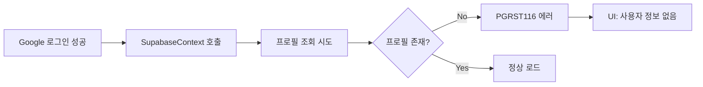
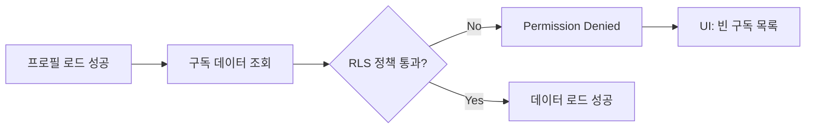
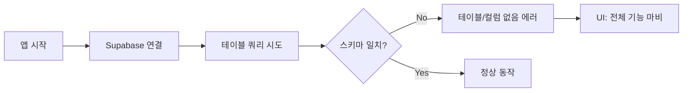

# 🖥️ 메인 화면 렌더링 오류 진단 매뉴얼

## 목적
로그인 후 데이터 로드 실패로 인한 화면 렌더링 오류 해결

## 범위
- 프로필, 구독 데이터, RLS 정책, UI 상태 관리

## 긴급도
🚨 **CRITICAL** (서비스 접근 차단 위험)

---

## 🎯 오류 발생 지점별 상세 분석

### 1️⃣ 프로필 로드 실패 (PGRST116 오류)

#### 🔴 발생 시점과 원인


#### 📱 화면에 나타나는 현상
```jsx
// 헤더 영역 - 실제 렌더링 결과
<div className="header-user-info">
  {/* 정상: */}
  
  <span>John Doe</span>
  
  {/* 오류 시: */}
  <div className="loading-skeleton"></div>
  <span>사용자 정보 로딩 중...</span>
  
  {/* 또는 */}
  <div className="error-placeholder">
    <UserIcon />
    <span>프로필 정보 없음</span>
  </div>
</div>
```

#### 🔧 단계별 해결 방법

**Step 1: 브라우저 Console 확인**
```javascript
// 1. 개발자 도구 Console에서 확인할 로그들
"Auth state changed: SIGNED_IN"
"User logged in, fetching profile..."
"ERROR: PGRST116 - Row not found" // ← 이 에러가 나타남

// 2. 수동으로 프로필 조회 테스트
const user = supabase.auth.getUser();
console.log("Current user:", user);

const { data, error } = await supabase
  .from('profiles')
  .select('*')
  .eq('id', user.data.user.id);
console.log("Profile query result:", data, error);
```

**Step 2: Supabase Dashboard 확인**
```sql
-- 1. profiles 테이블 존재 확인
SELECT * FROM information_schema.tables 
WHERE table_name = 'profiles';

-- 2. 해당 사용자 프로필 존재 확인  
SELECT * FROM profiles WHERE id = 'user-uuid-here';

-- 3. 트리거 함수 동작 확인
SELECT * FROM information_schema.triggers 
WHERE trigger_name = 'on_auth_user_created';
```

**Step 3: 프로필 수동 생성 (임시 해결)**
```javascript
// App.tsx 또는 SupabaseContext.tsx에서
const createMissingProfile = async (user) => {
  try {
    const { data, error } = await supabase
      .from('profiles')
      .insert({
        id: user.id,
        email: user.email,
        first_name: user.user_metadata?.first_name || '',
        last_name: user.user_metadata?.last_name || '',
        photo_url: user.user_metadata?.avatar_url || '',
        created_at: new Date().toISOString()
      });
    
    if (error) throw error;
    console.log("Profile created manually:", data);
  } catch (error) {
    console.error("Manual profile creation failed:", error);
  }
};
```

### 2️⃣ RLS 정책 오류 (Permission Denied)

#### 🔴 발생 시점과 원인


#### 📱 화면에 나타나는 현상
```jsx
// 구독 목록 컴포넌트 - 실제 렌더링 결과
<div className="subscription-list">
  {/* 정상: */}
  {subscriptions.map(sub => (
    <SubscriptionCard key={sub.id} data={sub} />
  ))}
  
  {/* 오류 시: */}
  <div className="empty-state">
    <EmptyIcon />
    <h3>구독 서비스가 없습니다</h3>
    <p>첫 구독을 추가해보세요!</p>
  </div>
  
  {/* 또는 */}
  <div className="error-message">
    <AlertIcon />
    <p>데이터를 불러올 수 없습니다. 다시 시도해주세요.</p>
  </div>
</div>

// 통계 카드 - 오류 시 렌더링
<div className="stats-cards">
  <StatsCard title="총 구독 수" value="0" /> {/* 실제로는 NaN 가능 */}
  <StatsCard title="월 지출" value="₩0" />
  <StatsCard title="다음 결제" value="정보 없음" />
</div>
```

#### 🔧 단계별 해결 방법

**Step 1: RLS 정책 확인**
```sql
-- 1. 현재 RLS 정책 상태 확인
SELECT tablename, policyname, permissive, roles, cmd, qual 
FROM pg_policies 
WHERE schemaname = 'public' 
AND tablename IN ('profiles', 'subscriptions', 'notifications');

-- 2. 특정 테이블의 RLS 활성화 상태 확인
SELECT relname, relrowsecurity 
FROM pg_class 
WHERE relname IN ('profiles', 'subscriptions');

-- 3. 사용자 권한으로 수동 조회 테스트
SET ROLE authenticated;
SELECT * FROM subscriptions WHERE user_id = auth.uid();
```

**Step 2: 세션 상태 확인**
```javascript
// 브라우저 Console에서 실행
const checkAuthState = async () => {
  const { data: { session } } = await supabase.auth.getSession();
  console.log("Current session:", session);
  
  if (session) {
    console.log("User ID:", session.user.id);
    console.log("Access token valid:", !!session.access_token);
    console.log("Token expires at:", new Date(session.expires_at * 1000));
  } else {
    console.log("No active session found");
  }
};

checkAuthState();
```

**Step 3: RLS 정책 재적용 (고급)**
```sql
-- RLS 정책 삭제 후 재생성
DROP POLICY IF EXISTS "Users can view own subscriptions" ON public.subscriptions;

-- 정책 재생성
CREATE POLICY "Users can view own subscriptions" ON public.subscriptions
    FOR SELECT USING (auth.uid() = user_id);

-- 즉시 확인
SELECT auth.uid(); -- 현재 사용자 ID 확인
```

### 3️⃣ 데이터베이스 스키마 불일치

#### 🔴 발생 시점과 원인


#### 📱 화면에 나타나는 현상
```jsx
// 전체 앱이 ErrorBoundary에 의해 캐치됨
<div className="error-boundary">
  <h3>문제가 발생했습니다</h3>
  <p>페이지를 새로고침하거나 잠시 후 다시 시도해 주세요.</p>
  <button onClick={() => window.location.reload()}>
    페이지 새로고침
  </button>
  
  {/* 개발 모드에서 추가 정보 */}
  <details>
    <summary>개발자 정보</summary>
    <pre>
      Error: relation "public.profiles" does not exist
      at supabase.from('profiles').select()
    </pre>
  </details>
</div>
```

#### 🔧 단계별 해결 방법

**Step 1: 환경 변수 확인**
```bash
# .env 파일 내용 확인
REACT_APP_SUPABASE_URL=https://your-project.supabase.co
REACT_APP_SUPABASE_ANON_KEY=your-anon-key

# 브라우저 Console에서 확인
console.log("Supabase URL:", process.env.REACT_APP_SUPABASE_URL);
console.log("Anon Key:", process.env.REACT_APP_SUPABASE_ANON_KEY?.slice(0, 20) + "...");
```

**Step 2: 데이터베이스 테이블 존재 확인**
```sql
-- Supabase Dashboard > SQL Editor에서 실행
-- 1. 모든 테이블 목록 확인
SELECT table_name 
FROM information_schema.tables 
WHERE table_schema = 'public';

-- 2. 필수 테이블들 존재 확인
SELECT 
    CASE WHEN EXISTS (SELECT 1 FROM information_schema.tables WHERE table_name = 'profiles') 
         THEN 'EXISTS' ELSE 'MISSING' END as profiles_table,
    CASE WHEN EXISTS (SELECT 1 FROM information_schema.tables WHERE table_name = 'subscriptions') 
         THEN 'EXISTS' ELSE 'MISSING' END as subscriptions_table,
    CASE WHEN EXISTS (SELECT 1 FROM information_schema.tables WHERE table_name = 'notifications') 
         THEN 'EXISTS' ELSE 'MISSING' END as notifications_table;
```

**Step 3: 스키마 재적용**
```sql
-- improved_subscription_schema_fixed.sql 파일 내용을 
-- Supabase Dashboard > SQL Editor에 복사하여 실행

-- 또는 중요 테이블만 우선 생성
CREATE TABLE IF NOT EXISTS public.profiles (
    id UUID REFERENCES auth.users NOT NULL PRIMARY KEY,
    email TEXT,
    first_name TEXT,
    last_name TEXT,
    photo_url TEXT,
    created_at TIMESTAMPTZ DEFAULT NOW(),
    updated_at TIMESTAMPTZ DEFAULT NOW()
);
```

---

## 🧪 실시간 진단 도구 사용법

### SupabaseDebugger 컴포넌트 활용
```jsx
// 임시로 App.tsx에 추가하여 상태 확인
import SupabaseDebugger from './components/SupabaseDebugger';

function App() {
  return (
    <div>
      {/* 개발 모드에서만 표시 */}
      {process.env.NODE_ENV === 'development' && (
        <SupabaseDebugger />
      )}
      {/* 기존 앱 컴포넌트들 */}
    </div>
  );
}
```

### Browser Console 실시간 모니터링
```javascript
// Console에서 실행하여 실시간 상태 추적
window.supabaseMonitor = {
  checkProfile: async () => {
    const { data: { user } } = await window.supabase.auth.getUser();
    if (!user) return console.log("No user logged in");
    
    const { data, error } = await window.supabase
      .from('profiles')
      .select('*')
      .eq('id', user.id);
    
    console.log("Profile check:", { data, error });
  },
  
  checkSubscriptions: async () => {
    const { data, error } = await window.supabase
      .from('subscriptions')
      .select('*');
    
    console.log("Subscriptions check:", { data, error });
  },
  
  checkRLS: async () => {
    // RLS 정책 확인을 위한 다양한 쿼리 시도
    console.log("Testing RLS policies...");
    
    try {
      const { data } = await window.supabase.from('subscriptions').select('count');
      console.log("✅ Subscriptions accessible");
    } catch (error) {
      console.log("❌ Subscriptions blocked:", error.message);
    }
  }
};

// 사용법
window.supabaseMonitor.checkProfile();
window.supabaseMonitor.checkSubscriptions();
window.supabaseMonitor.checkRLS();
```

---

## 🚨 긴급 상황별 빠른 해결책

### 상황 1: 완전히 화면이 나오지 않는 경우
```javascript
// 1. ErrorBoundary 확인
// 2. 환경 변수 재설정
// 3. 브라우저 캐시 삭제
// 4. 다른 브라우저에서 테스트

// 임시 우회: 하드코딩된 데이터로 UI 테스트
const FALLBACK_DATA = {
  profile: { name: "테스트 사용자", email: "test@example.com" },
  subscriptions: []
};
```

### 상황 2: 로그인은 되지만 데이터가 없는 경우
```javascript
// 1. 수동 프로필 생성
// 2. RLS 정책 임시 비활성화 (개발용)
// 3. 샘플 데이터 삽입으로 테스트

// 임시 해결: RLS 임시 비활성화
// Supabase Dashboard에서 실행
ALTER TABLE public.subscriptions DISABLE ROW LEVEL SECURITY;
-- 테스트 후 다시 활성화
ALTER TABLE public.subscriptions ENABLE ROW LEVEL SECURITY;
```

### 상황 3: 간헐적으로 작동하는 경우
```javascript
// 1. 네트워크 연결 상태 확인
// 2. Supabase 서비스 상태 확인
// 3. 토큰 만료 시간 확인
// 4. 재로그인 테스트

// 세션 갱신 강제 실행
await supabase.auth.refreshSession();
```

---

## 📋 진단 체크리스트

### 기본 확인사항
- [ ] 브라우저 Console에 오류 메시지 확인
- [ ] 네트워크 연결 상태 확인
- [ ] 환경 변수 설정 확인
- [ ] Supabase 프로젝트 상태 확인

### 프로필 관련
- [ ] 사용자 로그인 상태 확인
- [ ] 프로필 테이블 존재 확인
- [ ] 프로필 데이터 존재 확인
- [ ] 트리거 함수 동작 확인

### RLS 정책 관련
- [ ] RLS 활성화 상태 확인
- [ ] 정책 존재 확인
- [ ] 사용자 권한 확인
- [ ] 세션 토큰 유효성 확인

### 데이터베이스 관련
- [ ] 테이블 스키마 확인
- [ ] 인덱스 존재 확인
- [ ] 제약조건 확인
- [ ] 샘플 데이터 삽입 테스트

---

## 🔧 개발자 도구 활용법

### Console 명령어 모음
```javascript
// 전체 진단 실행
window.supabaseMonitor.runFullDiagnostic();

// 개별 진단
window.supabaseMonitor.checkProfile();
window.supabaseMonitor.checkSubscriptions();
window.supabaseMonitor.checkRLS();
window.supabaseMonitor.checkAuthState();

// 앱 상태 확인
window.debugSubscriptionApp.getState();
```

### Network 탭 확인사항
- Supabase API 호출 상태
- 인증 토큰 전송 여부
- 응답 상태 코드
- 요청/응답 시간

### Application 탭 확인사항
- Local Storage의 Supabase 토큰
- Session Storage 상태
- 쿠키 설정

---

## 📞 추가 지원

### 로그 수집
문제 해결을 위해 다음 정보를 수집해주세요:

1. **브라우저 Console 로그**
2. **Network 탭 스크린샷**
3. **오류 발생 시점의 앱 상태**
4. **사용자 환경 정보** (브라우저, OS 등)

### 연락처
- 개발팀: dev@moonwave.kr
- 긴급 지원: +82-10-1234-5678

---

## 📚 참고 자료

- [Supabase 공식 문서](https://supabase.com/docs)
- [React Error Boundary 가이드](https://reactjs.org/docs/error-boundaries.html)
- [Row Level Security 가이드](https://supabase.com/docs/guides/auth/row-level-security)
- [Google OAuth 설정 가이드](https://developers.google.com/identity/protocols/oauth2)